# Bagholder

A local-first trading journal for Wealthsimple users. It runs on your own computer, syncs your activity from Wealthsimple, and keeps everything in a local SQLite file. Nothing is uploaded anywhere.

Use at your own risk. The app has you sign in to the real Wealthsimple website in order to sync. The author is not responsible for your use or misuse of the app or any consequences thereof.

## Screenshots

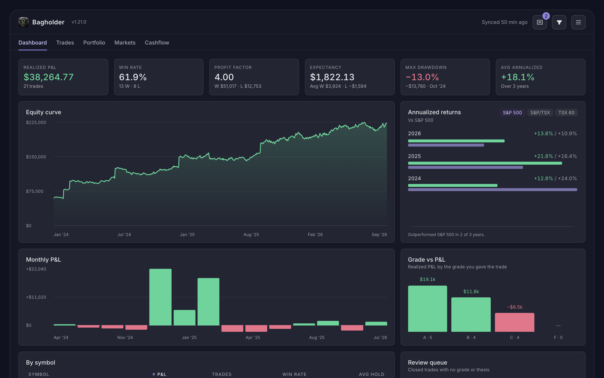

| Trades | A trade |
|---|---|
| 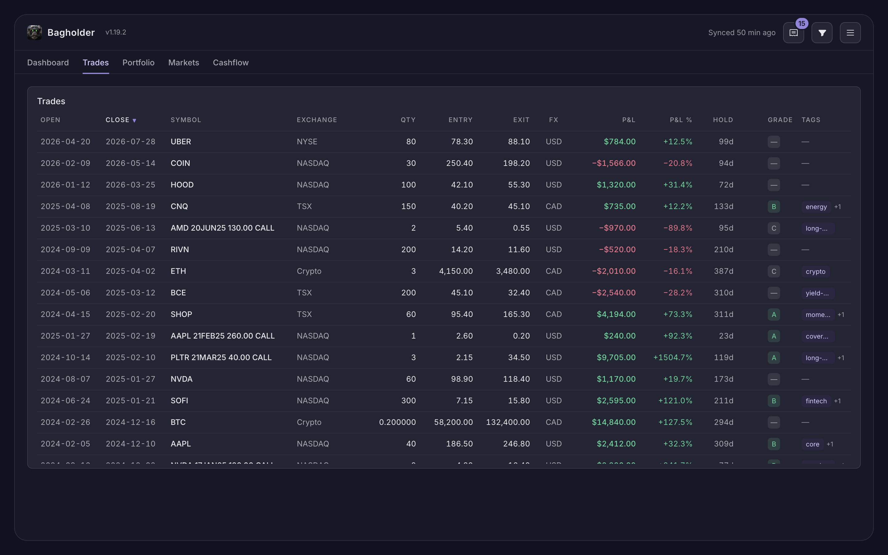 | 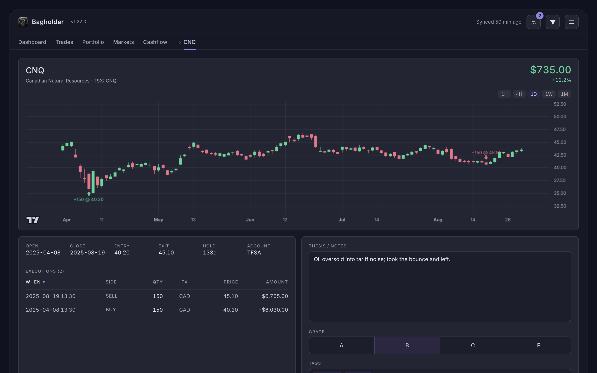 |
| **Positions** | **Cashflow** |
| 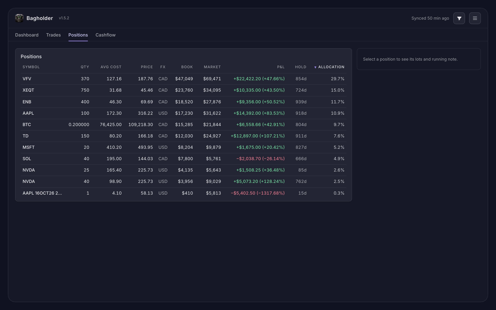 | 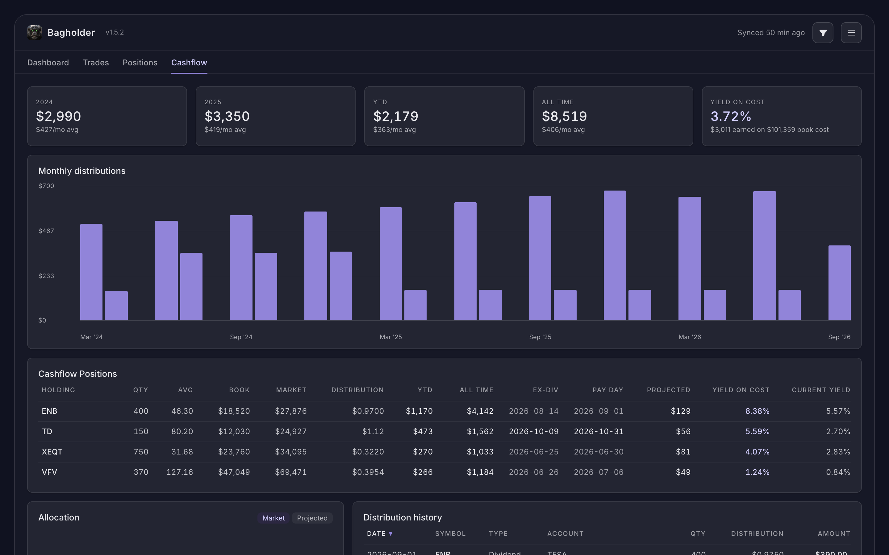 |

On iOS and Android:

<table>
<tr>
<td>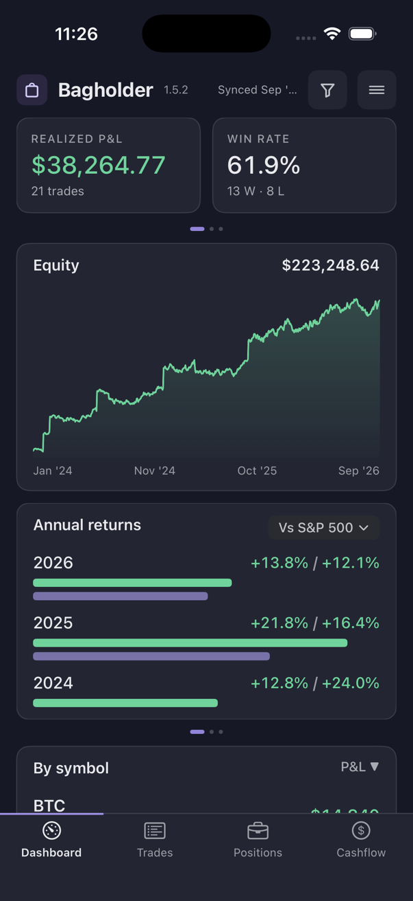</td>
<td>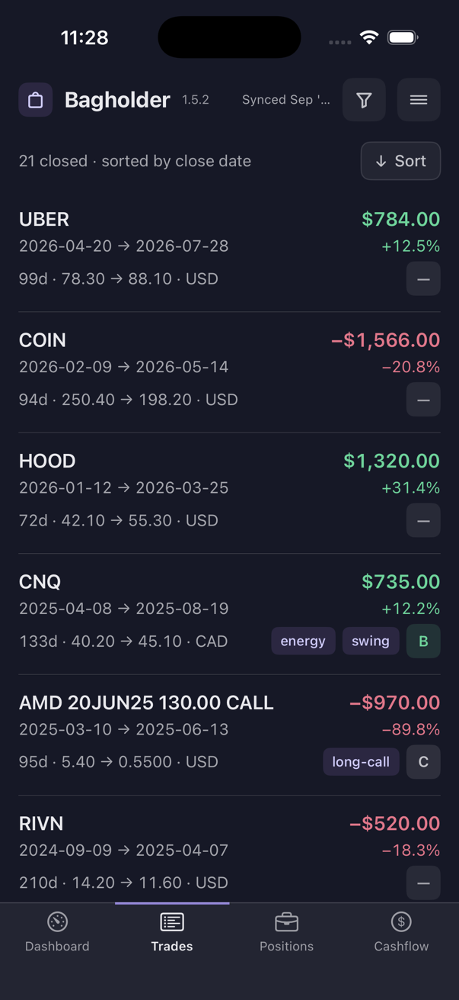</td>
<td>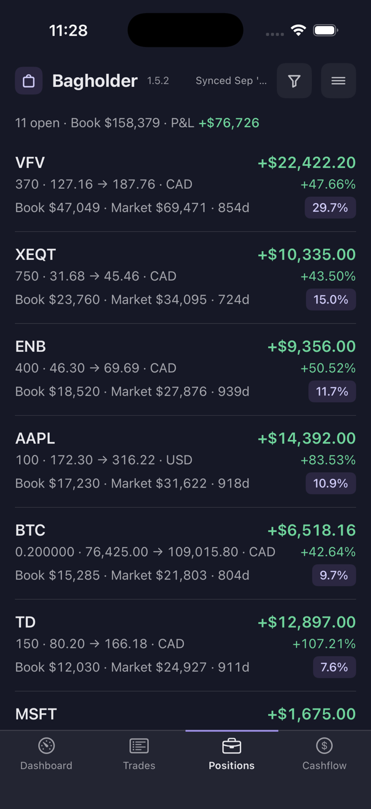</td>
<td>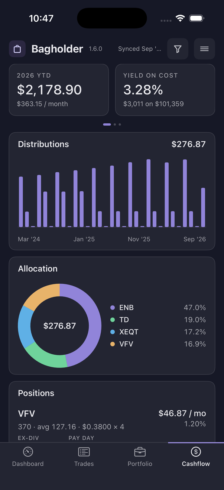</td>
</tr>
<tr>
<td>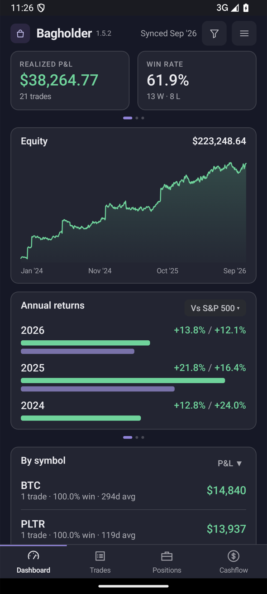</td>
<td>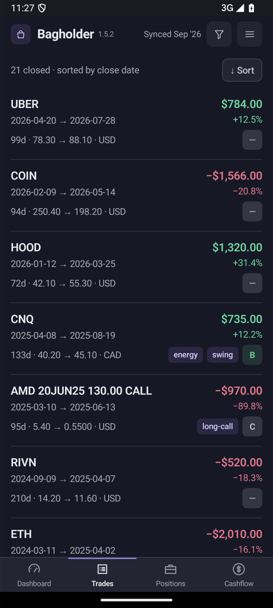</td>
<td>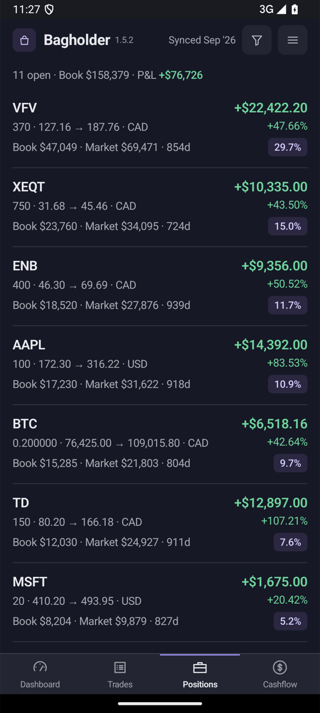</td>
<td>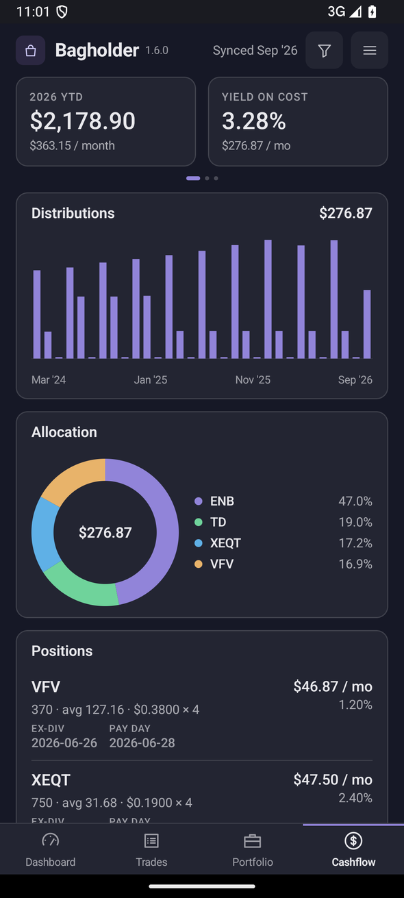</td>
</tr>
</table>

## What's supported

- Stocks and ETFs on Canadian and US exchanges, in CAD and USD
- Options, including covered calls, rolls, expiries and assignments
- Crypto, including staking rewards
- Dividends and distributions
- Any number of Wealthsimple accounts, self-directed or managed

Futures are not supported yet.

## Requirements

- Python 3.9 or newer
- Google Chrome (opened once so you can sign in to Wealthsimple)

## Install

```
python3 -m pip install -r requirements.txt
```

On Windows use `py` instead of `python3` throughout. The one dependency is `tzdata`, which Windows needs for time zones; macOS and Linux already have it.

## Run

```
python3 bagholder.py
```

The app opens at `http://127.0.0.1:8765` in your browser. Use that address as written; `localhost` is refused on purpose, since the server only answers its own machine.

## First use

Open the menu at the top right and choose **Connect Wealthsimple**. A Chrome window opens on Wealthsimple's sign-in page; sign in as usual. Bagholder closes that window itself once it has the session and starts syncing. Closing the window, or pressing Cancel in the header, ends the attempt; nothing reopens until you choose Connect again. It pulls your full history, and from then on syncs every weekday after 2 PM Mountain time while it is running. The session is refreshed automatically so you are not asked to sign in again.

The menu also offers:

- **Add trade** for a trade entered by hand.
- **Import CSV** for one or more Wealthsimple activity or statement exports.
- **Load folder** to watch a folder of CSV exports; new or changed files are imported every ten minutes.
- **Export trades CSV**, **Clear data**, and a **Theme** switch (Nocturne, Midnight, Light).

## What it shows

- **Dashboard**: realized P&L, win rate, profit factor, expectancy, max drawdown net of deposits and withdrawals, annualized returns vs the S&P 500 or the S&P/TSX Composite, equity curve, monthly P&L, P&L by grade, P&L by symbol, and a review queue of ungraded trades.
- **Trades**: every closed trade with its executions, a price path across the fills, and a journal with a thesis, a grade and tags. Shares, options and crypto are all matched FIFO per account; covered calls, rolls, expiries and assignments are handled.
- **Positions**: open positions with live prices, unrealized P&L, allocation, the lots still held, and a running note that carries over to the trade when the position closes.
- **Cashflow**: distributions by month and by holding, with yield on cost and current yield from each fund's declared distributions.

A filter icon next to the menu narrows every page at once by date, account, symbol, grade, tag, side, kind, exchange, price, hold time, P&L or quantity.

Per-trade figures are in the trade's currency. Anything that adds trades together is in CAD, converted on the fill dates.

## Data

Everything lives in `~/.bagholder/` (`%USERPROFILE%\.bagholder` on Windows): the database `bagholder.db` and the Wealthsimple session. Back up by copying the folder. **Clear data** in the menu wipes it and signs you out.

Market data the app needs but Wealthsimple does not provide is fetched over HTTPS and cached in the same database: USD/CAD rates from the Bank of Canada, S&P 500 closes from FRED, S&P/TSX Composite closes from TMX Money, prices and declared distributions from TMX Money, Cboe Canada prices from cboe.com, crypto prices from Coinbase, US option prices from Cboe's delayed chains, and daily price history for the trade chart from TMX Money, Cboe Canada and CoinGecko. The trade chart is drawn with TradingView's open-source Lightweight Charts, bundled with the app.
