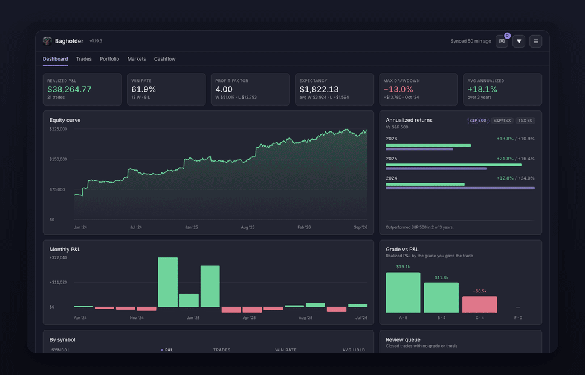
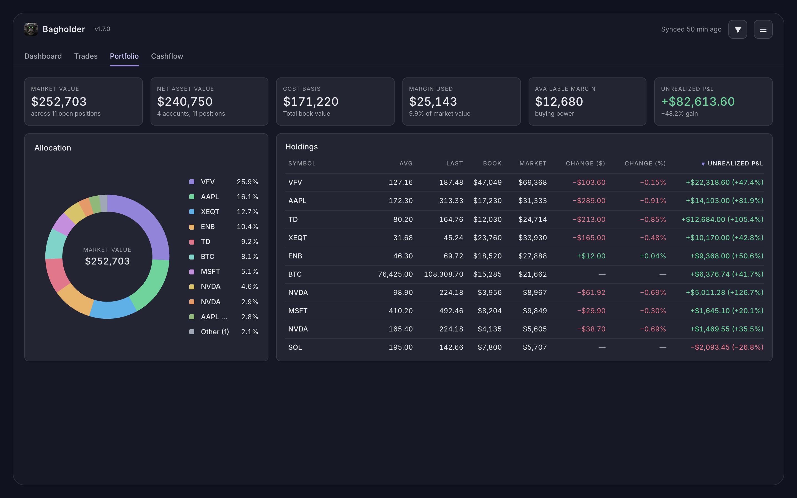
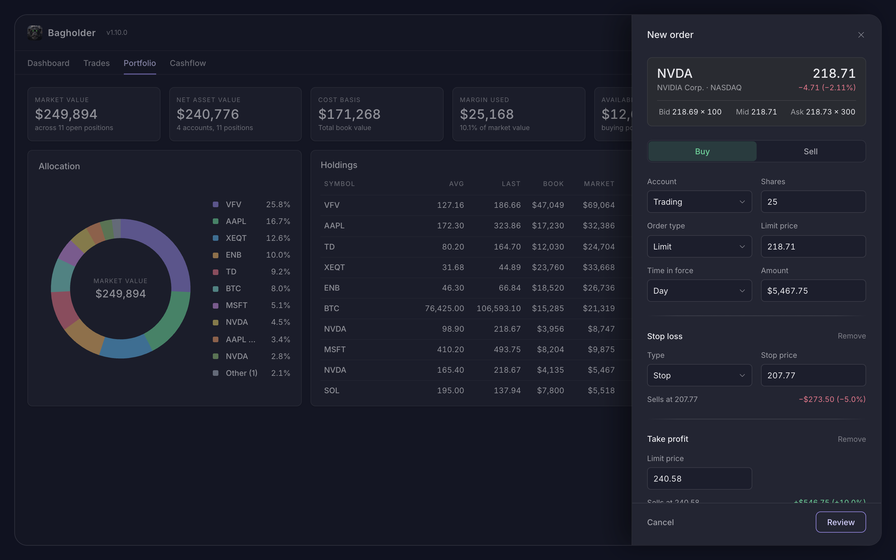
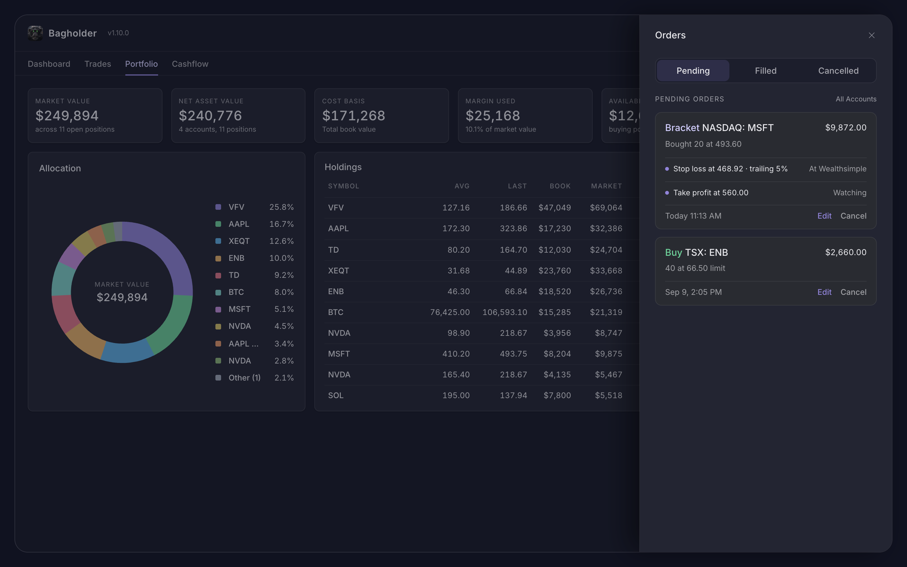
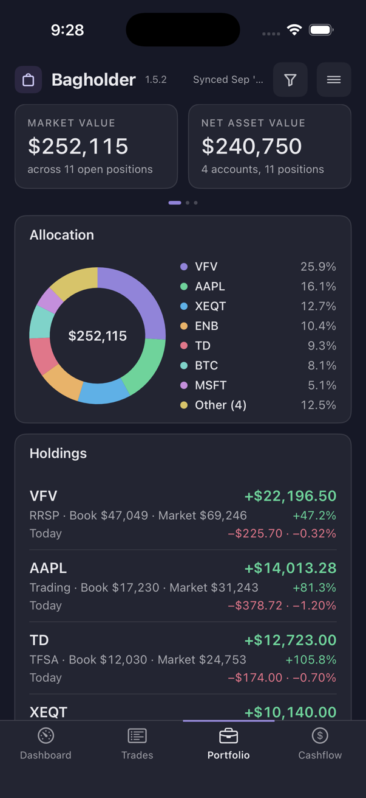
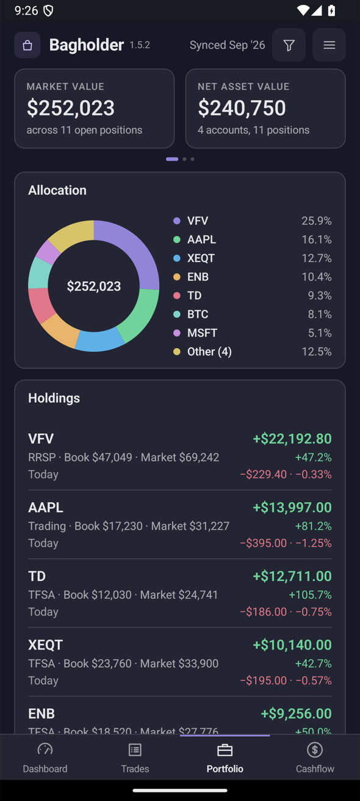

# Bagholder

A local-first trading journal for Wealthsimple users. It runs on your own computer, syncs your activity from Wealthsimple, and keeps everything in a local SQLite file. Nothing is uploaded anywhere.



Use at your own risk. The app has you sign in to the real Wealthsimple website in order to sync. The author is not responsible for your use or misuse of the app or any consequences thereof.

## Screenshots


| Trades | A trade |
|---|---|
|  |  |
| **Portfolio** | **Cashflow** |
|  |  |
| **Order ticket** | **Orders** |
|  |  |

On iOS and Android:

<table>
<tr>
<td></td>
<td></td>
<td></td>
<td></td>
</tr>
<tr>
<td></td>
<td></td>
<td></td>
<td></td>
</tr>
</table>

## What's supported

- Stocks and ETFs on Canadian and US exchanges, in CAD and USD
- Options, including covered calls, rolls, expiries and assignments
- Crypto, including staking rewards
- Dividends and distributions
- Any number of Wealthsimple accounts, self-directed or managed

Futures are not supported yet.

## Requirements

- Python 3.9 or newer
- Google Chrome (opened once so you can sign in to Wealthsimple)

## Install

```
python3 -m pip install -r requirements.txt
```

On Windows use `py` instead of `python3` throughout. The one dependency is `tzdata`, which Windows needs for time zones; macOS and Linux already have it.

## Run

```
python3 bagholder.py
```

The app opens at `http://127.0.0.1:8765` in your browser. Use that address as written; `localhost` is refused on purpose, since the server only answers its own machine.

## Docker

For a copy that runs in the background on a machine you keep on. Nothing is needed on the host but Docker: the image carries Chromium for the sign-in, and the database and the login live in `./data` beside the compose file.

```
docker compose up -d
```

Open `http://127.0.0.1:8765` and choose Connect Wealthsimple: the sign-in page opens inside the page. Sign in with your email, password and 2FA code (a passkey needs a real browser). The port is published on the host's loopback only. The image is published with every release; the header says when a new one is out and links to it, as on the desktop, and moving to it is a pull rather than the Update button:

```
docker compose pull && docker compose up -d
```

To build the image yourself instead, `docker build -t bagholder .` and point the compose file's `image` at `bagholder`.

## First use

Connect Wealthsimple and sign in. Bagholder pulls your full history, then syncs every weekday after the close while it is running.

Trades can also be imported from Wealthsimple's CSV exports, or entered by hand.

## What it shows

- **Dashboard**: realized P&L, win rate, profit factor, expectancy, max drawdown net of deposits and withdrawals, annualized returns vs the S&P 500 or the S&P/TSX Composite, equity curve, monthly P&L, P&L by grade, P&L by symbol, and a review queue of ungraded trades.
- **Trades**: every closed trade with its executions, a price path across the fills, and a journal with a thesis, a grade and tags. Shares, options and crypto are all matched FIFO per account; covered calls, rolls, expiries and assignments are handled.
- **Portfolio**: market value, net asset value, cost basis, margin used, available margin and unrealized P&L across the accounts you choose; allocation; every open holding with the day's change, each opening on its own page with the chart, the fills and the journal that becomes the trade's when it closes.
- **Cashflow**: distributions by month and by holding, with yield on cost and current yield from each fund's declared distributions.
- **Orders**: an order ticket for shares and ETFs, opened from a symbol in the search list, with a stop loss and a take profit alongside. After a buy fills, the stop loss is placed at Wealthsimple as its own stop order and the take profit is watched and placed when the price reaches it. An Orders panel from the header lists every order placed here or pending at Wealthsimple with its status read back, its brackets and their state, and lets you adjust a bracket, edit or cancel an open order.

A filter icon next to the menu narrows every page at once by date, account, symbol, grade, tag, side, kind, exchange, price, hold time, P&L or quantity.

Per-trade figures are in the trade's currency. Anything that adds trades together is in CAD, converted on the fill dates.

## Data

Everything lives in `~/.bagholder/` (`%USERPROFILE%\.bagholder` on Windows): the database `bagholder.db` and the Wealthsimple session. Back up by copying the folder. **Clear data** in the menu deletes the data and keeps the login; **Disconnect** removes the login and keeps the data.

Market data the app needs but Wealthsimple does not provide is fetched over HTTPS and cached in the same database: USD/CAD rates from the Bank of Canada, S&P 500 closes from FRED, S&P/TSX Composite closes from TMX Money, prices and declared distributions from TMX Money, Cboe Canada prices from cboe.com, crypto prices from Coinbase, US option prices from Cboe's delayed chains, and daily price history for the trade chart from TMX Money, Cboe Canada and CoinGecko. The trade chart is drawn with TradingView's open-source Lightweight Charts, bundled with the app.
